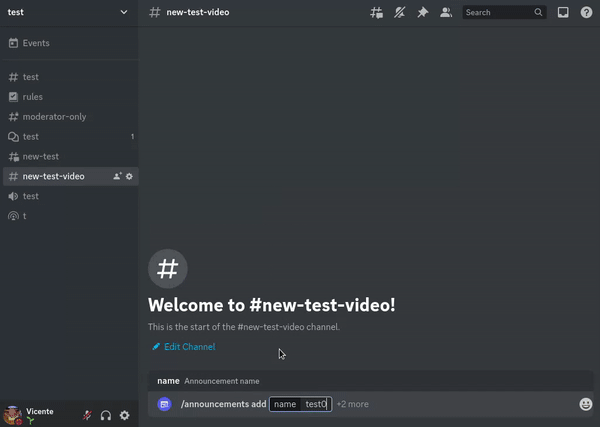

<a href="https://discord.com/api/oauth2/authorize?client_id=725373172391739402&permissions=274878221312&scope=bot">🚀 Invitación</a>
&nbsp;&nbsp;•&nbsp;&nbsp;
<a href="https://s.vicente015.dev/d">🏡 Servidor de soporte</a>
&nbsp;&nbsp;•&nbsp;&nbsp;
<a href="#contribute">🤝 Contribuir</a>
&nbsp;&nbsp;•&nbsp;&nbsp;
<a href="./README.md">🇺🇸 Inglés / English</a>

**AnnounceIt** es un bot de Discord diseñado para facilitar la comunicación en servidores con varios idiomas. Permite publicar mensajes con soporte para múltiples lenguajes y proporciona un botón para cambiar entre idiomas, asegurando que todos los usuarios puedan entender los anuncios importantes.

## Características

- Crear un anuncio usando los modals nativos de Discord.
- Personalizar con imágenes, miniaturas, título y pie de página en el embed.
- Personalizar el color del embed.

## Contribuir

¡Las contribuciones son siempre bienvenidas! 😊

Puedes contribuir sugiriendo ideas abriendo una issue, contribuir programando o traduciendo.

Lee `contributing.md` para ver cómo empezar.
